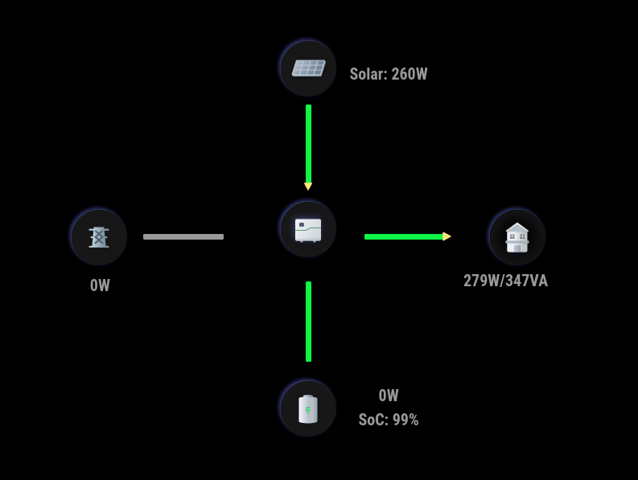

# MMM-Growatt

A [MagicMirror²](https://magicmirror.builders) module to display Growatt Power Plant Data from [Growatt](https://server.growatt.com.

[](LICENSE)

 

## Dependencies
- growatt
- Requires v2.21.0. Built and tested on this version. May work on earlier versions but not tested nor supported.

## Installation

In your terminal, go to your MagicMirror's Module folder:
````
cd ~/MagicMirror/modules
````

Clone this repository:
````
git clone https://github.com/mumblebaj/MMM-Growatt.git
````
````
cd MMM-Growatt
npm install
````

Add the module to the modules array in the `config/config.js` file:
````javascript
        {
            module: "MMM-Growatt",
            position: "middle_center",
            disabled: false,
            config: {
                username: "username",
                password: "password",
                plantId: "plantId"
        }
},
````

## Updating

To update the module to the latest version, use your terminal to go to your MMM-Growatt module folder and type the following command:

````
cd MMM-Growatt
git pull
npm install

```` 

