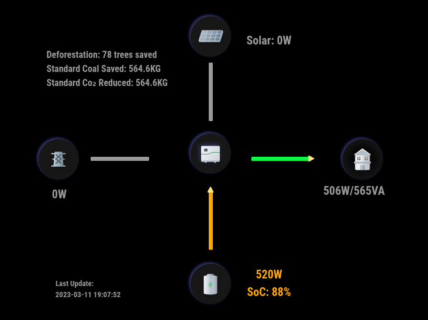

# MMM-Growatt

A [MagicMirror²](https://magicmirror.builders) module to display Growatt Power Plant Data from [Growatt](https://server.growatt.com).

[](LICENSE)




## Dependencies
- [growatt](https://www.npmjs.com/package/growatt)
- Requires MagicMirror² v2.21.0. Built and tested on this version. May work on earlier versions but not tested nor supported.
- Requires that you have an account on [Growatt.com](https://server.growatt.com/login)

## Installation

In your terminal, go to your MagicMirror's Module folder:
````
cd ~/MagicMirror/modules
````

Clone this repository:
````
git clone https://github.com/mumblebaj/MMM-Growatt.git
````
````
cd MMM-Growatt
npm install
````

Add the module to the modules array in the `config/config.js` file:
````javascript
        {
            module: "MMM-Growatt",
            position: "middle_center", //Works best at middle_center. May not display all that well in other positions
            disabled: false,
            config: {
                username: "username",
                password: "password",
                usServer: true, // only used by US Registered users
                debug: false, // set to true if you want to create a debug log
                mode: "dual", // Specify 'dual' when running https://github.com/mumblebaj/MMM-Growatt.git and https://github.com/mumblebaj/MMM-Growatt-Stats.git together else specify 'single'
                updateInterval: 1000*60*30 //Update every 30 minutes
                
                        }
},
````

## Updating

To update the module to the latest version, use your terminal to go to your MMM-Growatt module folder and type the following command:

````
cd MMM-Growatt
git pull
npm install

```` 
## Changes
Updated module to no longer require user to specify plantId and deviceSerial. The values will be automatically obtained.

### 2023/08/07
- Update module to use growatt v 0.5.6
- Update to cater for different growatt inverter types
- Types catered for
  - storage
  - tlx
  - tlxh
- Dynamically get plantId and deviceSerial

### 2023/08/09
- Add a dual and single mode to allow running [MMM-Growatt](https://github.com/mumblebaj/MMM-Growatt.git) and [MMM-Growatt-Stats](https://github.com/mumblebaj/MMM-Growatt-Stats.git) to operate together based on a single set of data.
- This change essentially allows for a single data query and sends the data up to the MMM-Growatt-Stats module which now does not need to make it's own call unless it is run in "single" mode.
- Add a debug mode to allow collection of API data for investigations

### 2023/08/09
- Had a request from user [ruralbrewer](https://github.com/ruralbrewer) to add support for [https://server-us.growatt.com](https://server-us.growatt.com).
- Users in the US registered on the US Growatt Server are now able to use the module.
- A new Config option  usServer: true must be added to the config/config.js. Users registered on the [https://server.growatt.com](https://server.growatt.com) need not add this option.