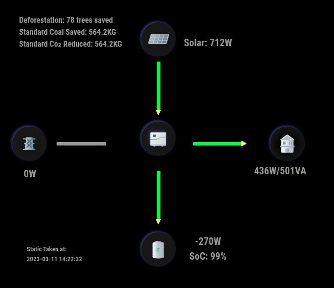
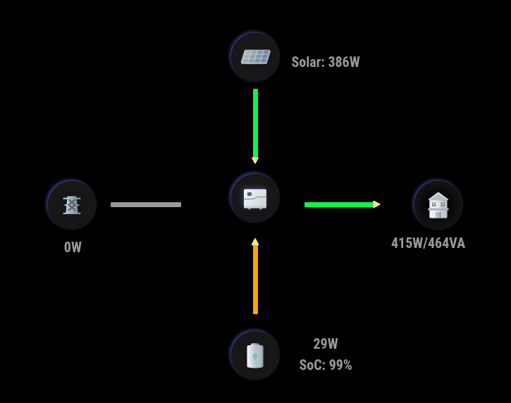
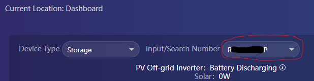

# MMM-Growatt

A [MagicMirror²](https://magicmirror.builders) module to display Growatt Power Plant Data from [Growatt](https://server.growatt.com).

[](LICENSE)

 
 

## Dependencies
- [growatt](https://www.npmjs.com/package/growatt)
- Requires MagicMirror² v2.21.0. Built and tested on this version. May work on earlier versions but not tested nor supported.
- Requires that you have an account on [Growatt.com](https://server.growatt.com/login)

## Installation

In your terminal, go to your MagicMirror's Module folder:
````
cd ~/MagicMirror/modules
````

Clone this repository:
````
git clone https://github.com/mumblebaj/MMM-Growatt.git
````
````
cd MMM-Growatt
npm install
````

Add the module to the modules array in the `config/config.js` file:
````javascript
        {
            module: "MMM-Growatt",
            position: "middle_center", //Works best at middle_center. May not display all that well in other positions
            disabled: false,
            config: {
                username: "username",
                password: "password",
                plantId: "plantId", // Can be obtained from the Growatt site by checking your Plant information. This can be accessed from the left side of the screen
                updateInterval: 1000*60*30 ,//Update every 30 minutes
                deviceSerial: "deviceSerial" //This is the device serial number. Can be found under Input Search Number. 
                        }
},
````
  

## Updating

To update the module to the latest version, use your terminal to go to your MMM-Growatt module folder and type the following command:

````
cd MMM-Growatt
git pull
npm install

```` 

