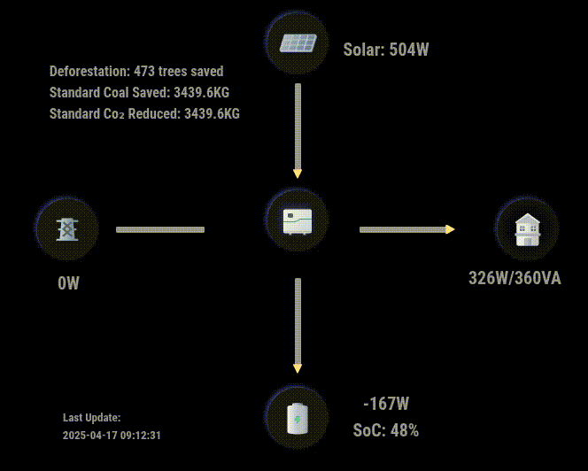

# MMM-Growatt

A [MagicMirror²](https://magicmirror.builders) module to display Growatt Power Plant Data from [Growatt](https://server.growatt.com).

[](https://MagicMirror.builders)
[](LICENSE)

## Support
If you like my module you can support my work by giving me a star ir buy me a coffee.

<a href="https://www.buymeacoffee.com/mumblebaj" target="_blank"></a>


## Dependencies
- [growatt](https://www.npmjs.com/package/growatt)
- Requires MagicMirror² v2.21.0. Built and tested on this version. May work on earlier versions but not tested nor supported.
- Requires that you have an account on [Growatt.com](https://server.growatt.com/login)

## Installation

In your terminal, go to your MagicMirror's Module folder:
````
cd ~/MagicMirror/modules
````

Clone this repository:
````
git clone https://github.com/mumblebaj/MMM-Growatt.git
````
````
cd MMM-Growatt
npm install
````

Add the module to the modules array in the `config/config.js` file:
````javascript
        {
            module: "MMM-Growatt",
            position: "middle_center", //Works best at middle_center. May not display all that well in other positions
            disabled: false,
            config: {
                username: "username",
                password: "password",
                usServer: true, // only used by US Registered users
                debug: false, // set to true if you want to create a debug log
                mode: "dual", // Specify 'dual' when running https://github.com/mumblebaj/MMM-Growatt.git and https://github.com/mumblebaj/MMM-Growatt-Stats.git together else specify 'single'
                view: "table", // Only add this if you want a minimalystic table view
                rowToDisplay: [ "loadPower", "batteryPower", "solar", "gridPower" ], //Remove items you do not want to display on the table. Table will be ordered in the same order as items appear in the list. Not required of view is not table
                updateInterval: 1000*60*30 //Update every 30 minutes
                
                        }
},
````

## Updating

To update the module to the latest version, use your terminal to go to your MMM-Growatt module folder and type the following command:

````
cd MMM-Growatt
git pull
npm install

```` 
## Changes

### 2025/06/24 - v2.2.0
#### You do not have to upgrade to this latest version unless your current version is no longer working.
- Refactor node_helper code
- Improve logic
- Add new helper functions
- Add a retry for login and getAllPlantData

### 2025/06/23
- Add Inverter type mix

### 2025/06/10 v2.1.6
- Update growatt module to latest

### 2025/04/25
- Change the module CSS to be a little more flexible and fit better in regions other the `middle_center`

### 2025/04/17
- Added animation to the arrow lines for a better visual effect

#### Example: All arrows active
All arrows are active feeding from grid and solar, feeding home and charging battery.


#### Example: Solar, home and Battery, no Grid feed
Example shows that Solar is charging battery and feeding home


#### Example: Battery and Solar feeding home
Example of Battery and Solr feeding home.


### 2025/03/21
- Added support for noah, which is part of the Growatt Neo 800Mx package. The setup of this Neo package is a little different to the normal setup. This now adds support for this Neo package. 

### 2025/03/08
- Add a minimalystic (table) view.

### 2025/03/02
- Add support for tlxh grid export

### 2025/02/28
- Update module to  provide import and export to and from grid data for tlxh.

Updated module to no longer require user to specify plantId and deviceSerial. The values will be automatically obtained.

### 2024/07/04
- Update the version of growatt to v0.7.4 as there were some changes on growatt

### 2024/01/27
- Update module to use latest growatt v 0.7.1

### 2023/08/07
- Update module to use growatt v 0.5.6
- Update to cater for different growatt inverter types
- Types catered for
  - storage
  - tlx
  - tlxh
- Dynamically get plantId and deviceSerial

### 2023/08/09
- Add a dual and single mode to allow running [MMM-Growatt](https://github.com/mumblebaj/MMM-Growatt.git) and [MMM-Growatt-Stats](https://github.com/mumblebaj/MMM-Growatt-Stats.git) to operate together based on a single set of data.
- This change essentially allows for a single data query and sends the data up to the MMM-Growatt-Stats module which now does not need to make it's own call unless it is run in "single" mode.
- Add a debug mode to allow collection of API data for investigations

### 2023/08/31
- Had a request from user [ruralbrewer](https://github.com/ruralbrewer) to add support for [https://server-us.growatt.com](https://server-us.growatt.com).
- Users in the US registered on the US Growatt Server are now able to use the module.
- A new Config option  usServer: true must be added to the config/config.js. Users registered on the [https://server.growatt.com](https://server.growatt.com) need not add this option.